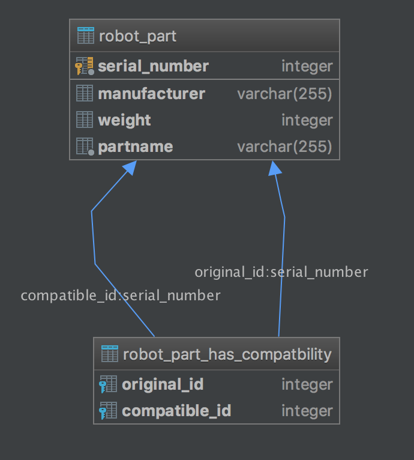

Robot Part Inventory Service
=================

## Abstract

The Robot Part Inventory Service provides access to robot part inventory data. 
An robot part can be created, read, (partially) updated and deleted via a REST API.<br/><br/>
This service is bases on the following technologies:
- Core Service: Spring-boot
- Database: H2 (For reasons of simplicity)
- TestFramework: Junit5 for Unittests

The information flows like the follows:

Rest-Controller <--> Service <--> ORM-Layer <--> Database

- Rest-Controller can be found in controller package
- Service can be found in service package
- Database access can be found in repository package
- Database is a in-memory h2 database
## Running the service

Clone the repository:

```bash
$ git clone ssh://git@s
```

Build the project<br/>
On Mac:
```bash
cd path/to/project
./gradlew clean build
```

On Windows:
```bash
cd path/to/project
gradlew.bat clean build
```

Now you can run the service with:

```bash
$ ./gradlew bootRun
```

on success you can open [http://localhost:8002/manage/health](http://localhost:8002/manage/health) returning 200 and JSON response including "status":"UP".

## Testing

Run unit tests:

```bash
./gradlew clean test
```

Run integration test
```bash
./gradlew clean integrationTest
```


## Entering the client
After running the service, open [http://localhost:8002/swagger-ui.html](http://localhost:8002/swagger-ui.html) in browser and you will see the swagger-ui. A simple client for the rest interface


## REST-API Documentation

Documented with Swagger and available on started service using path "/swagger-ui.html" <br/>
[http://localhost:8002/swagger-ui.html](http://localhost:8002/swagger-ui.html)

## Database model
At the moment we just need two tables in our database:
- RobotPart
- RobotPart_Has_Compatibility




## Possible scalability and high availability problems
 
 This service is very simple in its current state. Till now there are no thoughts spend on scalability or high availability.
 
 ###What can be done generally
 "The Art of Scalability" describes scalability using a cube model. The "Scale Cube" is composed of an X-axis, Y-axis, and Z-axis.

 ####X-axis: Scaling by splitting the service
 I think with its current feature-set, the robot part service is micro enough and needs no further splitting
 ####Y-axis: Scaling by running multiple load-balanced instances 
 Thats something we should definetly do! I would suggest a minimum of four instances for productive use. More if needed. This point also applies to High availabilty.
 ####Z:axis: Scaling by splitting data
 One PostgeSQL would not be enough. We need a database cluster. This point also applies to High availabilty 

 
###Current Problems with scalability
 - We can't scale to more instances due to the in-memory database
 - Currently there are no database performance improvements, like an index on serialNumber
 - The performance is not measured, we don't know about any performance leaks
 
###What must be done
 - Migrate to a relational non-in-memory-database
 - Measure performance with performance tests
 
 

## Secure access

Currently this service is a open book for everyone that knows the url. Assuming there is more then one service that will be used we should think about an API-Gateway.
The Gateway would receive all the service-request and routes them to the service. 
The API-Gateway should act as a resource server as defined by the OAuth2 protocol. This way it would refuse all service requests without a valid access token.

The access Token holds informations about the expiration date, roles (permissions) and a global-user-id.
With this informations the service can implement mechanics to restrict access to all available resources.

## Maintenance / Contact

* Timo Fiebiger
* EMail t.fiebiger@icloud.com
